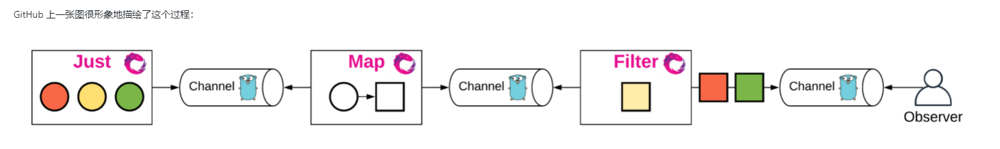

# 字符串

## bytebufferpool

在编程开发中，我们经常会需要**频繁**创建和销毁同类对象的情形。这样的操作很可能会对性能造成影响。这时，常用的优化手段就是使用**对象池**（object pool）。需要创建对象时，我们先从对象池中查找。如果有空闲对象，则从池中移除这个对象并将其返回给调用者使用。只有在池中无空闲对象时，才会真正创建一个新对象。另一方面，对象使用完之后，我们并不进行销毁。而是将它放回到对象池以供后续使用。使用对象池在频繁创建和销毁对象的情形下，能大幅度提升性能。同时，为了避免对象池中的对象占用过多的内存。对象池一般还配有特定的清理策略。Go 标准库`sync.Pool`就是这样一个例子。`sync.Pool`中的对象会被垃圾回收清理掉。

在这类对象中，比较特殊的一类是字节缓冲（底层一般是字节切片）。在做字符串拼接时，为了拼接的高效，我们通常将中间结果存放在一个字节缓冲。在拼接完成之后，再从字节缓冲中生成结果字符串。在收发网络包时，也需要将不完整的包暂时存放在字节缓冲中。

Go 标准库中的类型`bytes.Buffer`封装字节切片，提供一些使用接口。我们知道切片的容量是有限的，容量不足时需要进行扩容。而频繁的扩容容易造成性能抖动。[`bytebufferpool`](https://github.com/valyala/bytebufferpool)实现了自己的`Buffer`类型，并使用一个简单的算法降低扩容带来的性能损失。`bytebufferpool`已经在大名鼎鼎的 Web 框架[fasthttp](https://github.com/valyala/fasthttp)和灵活的 Go 模块库[quicktemplate](https://github.com/valyala/quicktemplate)得到了应用。实际上，这 3 个库是同一个作者：valyala😀。

## commonregex

有时，我们会遇到一些需要使用字符串的匹配和查找的任务。并且我们知道这种情况下，使用正则表达式是最简洁和优雅的。为了完成某个任务特地去系统地学习正则表达式费时费力，而且一段时间不用又很容易遗忘。下次遇到问题还要再重复这个过程。[`commonregex`](https://github.com/mingrammer/commonregex)库来了，它内置很多常用的正则表达式，开箱即用。当然，我并不是说没必要去学习正则表达式，熟练掌握正则表达式需要时间和练习，对于时长和文本处理打交道的开发人员，正则表达式决定是提升工作效率的一把利器。

# 异步编程

## rxgo

[ReactiveX](http://reactivex.io/#)，简称为 Rx，是一个异步编程的 API。与 **callback**（回调）、**promise**（JS 提供这种方式）和 **deferred**（Python 的 twisted 网络编程库就是使用这种方式）这些异步编程方式有所不同，Rx 是基于事件流的。这里的事件可以是系统中产生或变化的任何东西，在代码中我们一般用对象表示。在 Rx 中，事件流被称为 **Observable**（可观察的）。事件流需要被 **Observer**（观察者）处理才有意义。想象一下，我们日常作为一个 **Observer**，一个重要的工作就是观察 BUG 的事件流。每次发现一个 BUG，我们都需要去解决它。

Rx 仅仅只是一个 API 规范的定义。Rx 有多种编程语言实现，`RxJava/RxJS/Rx.NET/RxClojure/RxSwift`。RxGo 是 Rx 的 Go 语言实现。借助于 Go 语言简洁的语法和强大的并发支持（goroutine、channel），Rx 与 Go 语言的结合非常完美。

**pipelines** (官方博客：https://blog.golang.org/pipelines)是 Go 基础的并发编程模型。其中包含，fan-in——多个 goroutine 产生数据，一个goroutine 处理数据，fan-out——一个 goroutine 产生数据，多个 goroutine 处理数据，fan-inout——多个 goroutine 产生数据，多个 goroutine 处理数据。它们都是通过 channel 连接。RxGo 的实现就是基于 **pipelines** 的理念，并且提供了方便易用的包装和强大的扩展。

## jobrunner

我们在 Web 开发中时常会遇到这样的需求，执行一个操作之后，需要给用户一定形式的通知。例如，用户下单之后通过邮件发送电子发票，网上购票支付后通过短信发送车次信息。但是这类需求并不需要非常及时，如果放在请求流程中处理，会影响请求的响应时间。这类任务我们一般使用异步的方式来执行。[`jobrunner`](https://github.com/bamzi/jobrunner)就是其中一个用来执行异步任务的 Go 语言库。得益于强大的[`cron`](https://github.com/robfig/cron)库，再搭配`jobrunner`的任务状态监控，`jobrunner`非常易于使用。

# HTML解析

## goquery

[goquery](https://github.com/PuerkitoBio/goquery)是用 Go 语言编写的一个类似于 jQuery 的库。它基于 HTML 解析库[net/html](https://pkg.go.dev/golang.org/x/net/html)和 CSS 库[cascadia](https://github.com/andybalholm/cascadia)，提供与 jQuery 相近的接口。Go 著名的爬虫框架[colly](https://github.com/gocolly/colly)就是基于 goquery 的。

# 热加载

## air

[`air`](https://www.topgoer.cn/docs/goday/github.com/cosmtrek/air)是 Go 语言的热加载工具，它可以监听文件或目录的变化，自动编译，重启程序。大大提高开发期的工作效率。

# 模板库

## quicktemplate

最近在整理我们项目代码的时候，发现有很多活动的代码在结构和提供的功能上都非常相似。为了方便今后的开发，我花了一点时间编写了一个生成代码框架的工具，最大程度地降低重复劳动。代码本身并不复杂，且与项目代码关联性较大，这里就不展开介绍了。在这个过程中，我发现 Go 标准的模板库`text/template`和`html/template`使用起来比较束手束脚，很不方便。我从 GitHub 了解到[`quicktemplate`](https://github.com/valyala/quicktemplate)这个第三方模板库，功能强大，语法简单，使用方便。今天我们就来介绍一下`quicktemplate`。

## fasttemplate

[`fasttemplate`](https://github.com/valyala/fasttemplate)是一个比较简单、易用的小型模板库。`fasttemplate`的作者[valyala](https://github.com/valyala)另外还开源了不少优秀的库，如大名鼎鼎的`fasthttp`，前面介绍的`bytebufferpool`，还有一个重量级的模板库`quicktemplate`。`quicktemplate`比标准库中的`text/template`和`html/template`要灵活和易用很多，后面会专门介绍它。今天要介绍的`fasttemlate`只专注于一块很小的领域——字符串替换。它的目标是为了替代`strings.Replace`、`fmt.Sprintf`等方法，提供一个简单，易用，高性能的字符串替换方法。

本文首先介绍`fasttemplate`的用法，然后去看看源码实现的一些细节。

# json操作

## gabs

JSON 是一种非常流行的数据交换格式。每种编程语言都有很多操作 JSON 的库，标准库、第三方库都有。Go 语言中标准库内置了 JSON 操作库`encoding/json`。我们之前也介绍过专门用于**查询** JSON 串的库[gjson](https://darjun.github.io/2020/03/22/godailylib/gjson/)和专门用于**修改** JSON 串的库[sjson](https://darjun.github.io/2020/03/24/godailylib/sjson)，还有一个非常方便的操作 JSON 数据的命令行工具[jj](https://darjun.github.io/2020/03/25/godailylib/jj/)。今天我们再介绍一个 JSON 工具库——[`gabs`](https://github.com/Jeffail/gabs)。`gabs`是一个用来查询和修改 JSON 串的库。它使用`encoding/json`将一般的 JSON 串转为`map[string]interface{}`，并提供便利的方法操作`map[string]struct{}`

## jj

在前面两篇文章中，我们分别介绍了快速读取 JSON 值的库`gjson`和快速设置 JSON 值的库`sjson`。今天我们介绍它们的作者[tidwall](https://github.com/tidwall)的一个基于`gjson`和`sjson`的非常实用的命令行工具[`jj`](https://github.com/tidwall/jj)。它是使用 Go 编写的快速读取和设置 JSON 值的命令行程序。

## sjson

在[上一篇文章](https://darjun.github.io/2020/03/22/godailylib/gjson)中我们介绍了如何使用`gjson`快速读取 JSON 串中的值。为了内容的完整性，今天我们介绍一下如何使用[`sjson`](https://github.com/tidwall/sjson)快速设置 JSON 串中的值。

## gjson

之前我们介绍过[`gojsonq`](https://darjun.github.io/2020/02/24/godailylib/gojsonq/)，可以方便地从一个 JSON 串中读取值。同时它也支持各种查询、汇总统计等功能。今天我们再介绍一个类似的库[`gjson`](https://github.com/tidwall/gjson)。在上一篇文章[Go 每日一库之 buntdb](https://darjun.github.io/2020/03/21/godailylib/buntdb/)中我们介绍过 JSON 索引，内部实现其实就是使用`gjson`这个库。`gjson`实际上是`get + json`的缩写，用于读取 JSON 串，同样的还有一个[`sjson`](https://github.com/tidwall/sjson)（`set + json`）库用来设置 JSON 串。

## gojsonq

在日常工作中，每一名开发者，不管是前端还是后端，都经常使用 JSON。JSON 是一个很简单的数据交换格式。相比于 XML，它灵活、轻巧、使用方便。JSON 也是[RESTful API](http://www.ruanyifeng.com/blog/2014/05/restful_api.html)推荐的格式。有时，我们只想读取 JSON 中的某一些字段。如果自己手动解析、一层一层读取，这就变得异常繁琐了。特别是在嵌套层次很深的情况下。今天我们介绍[`gojsonq`](https://github.com/thedevsaddam/gojsonq)。它可以帮助我们很方便的操作 JSON。

# map转struct

## mapstructure

[`mapstructure`](https://github.com/mitchellh/mapstructure)用于将通用的`map[string]interface{}`解码到对应的 Go 结构体中，或者执行相反的操作。很多时候，解析来自多种源头的数据流时，我们一般事先并不知道他们对应的具体类型。只有读取到一些字段之后才能做出判断。这时，我们可以先使用标准的`encoding/json`库将数据解码为`map[string]interface{}`类型，然后根据标识字段利用`mapstructure`库转为相应的 Go 结构体以便使用。

# 定时任务

## cron

[`cron`](https://github.com/robfig/cron)一个用于管理定时任务的库，用 Go 实现 Linux 中`crontab`这个命令的效果。之前我们也介绍过一个类似的 Go 库——[`gron`](https://darjun.github.io/2020/04/20/godailylib/gron/)。`gron`代码小巧，用于学习是比较好的。但是它功能相对简单些，并且已经不维护了。如果有定时任务需求，还是建议使用`cron`。

## gron

[`gron`](https://github.com/roylee0704/gron)是一个比较小巧、灵活的定时任务库，可以执行定时的、周期性的任务。`gron`提供简洁的、并发安全的接口。我们先介绍`gron`库的使用，然后简单分析一下源码。

## carbon

一线开发人员每天都要使用日期和时间相关的功能，各种定时器，活动时间处理等。标准库[time](https://golang.org/pkg/time)使用起来不太灵活，特别是日期时间的创建和运算。[carbon](https://github.com/uniplaces/carbon)库是一个时间扩展库，基于 PHP 的[carbon](https://github.com/briannesbitt/carbon)库编写。提供易于使用的接口。本文就来介绍一下这个库。

# 命令行工具

## cli

[`cli`](https://github.com/urfave/cli)是一个用于构建命令行程序的库。我们之前也介绍过一个用于构建命令行程序的库[`cobra`](https://darjun.github.io/2020/01/17/godailylib/cobra/)。在功能上来说两者差不多，`cobra`的优势是提供了一个脚手架，方便开发。`cli`非常简洁，所有的初始化操作就是创建一个`cli.App`结构的对象。通过为对象的字段赋值来添加相应的功能。

`cli`与我们上一篇文章介绍的`negroni`是同一个作者[urfave](https://github.com/urfave)。

## cobra

[cobra](http://github.com/spf13/cobra)是一个命令行程序库，可以用来编写命令行程序。同时，它也提供了一个脚手架，
用于生成基于 cobra 的应用程序框架。非常多知名的开源项目使用了 cobra 库构建命令行，如[Kubernetes](http://kubernetes.io/)、[Hugo](http://gohugo.io/)、[etcd](https://github.com/coreos/etcd)等等等等。
本文介绍 cobra 库的基本使用和一些有趣的特性。

## go-flags

在[上一篇文章](https://darjun.github.io/2020/01/07/godailylib/flag/)中，我们介绍了`flag`库。`flag`库是用于解析命令行选项的。但是`flag`有几个缺点：

- 不显示支持短选项。当然上一篇文章中也提到过可以通过将两个选项共享同一个变量迂回实现，但写起来比较繁琐；
- 选项变量的定义比较繁琐，每个选项都需要根据类型调用对应的`Type`或`TypeVar`函数；
- 默认只支持有限的数据类型，当前只有基本类型`bool/int/uint/string`和`time.Duration`；

为了解决这些问题，出现了不少第三方解析命令行选项的库，今天的主角[`go-flags`](https://github.com/jessevdk/go-flags)就是其中一个。第一次看到`go-flags`库是在阅读[pgweb](https://github.com/sosedoff/pgweb)源码的时候。

`go-flags`提供了比标准库`flag`更多的选项。它利用结构标签（struct tag）和反射提供了一个方便、简洁的接口。它除了基本的功能，还提供了丰富的特性：

- 支持短选项（-v）和长选项（–verbose）；
- 支持短选项合写，如`-aux`；
- 同一个选项可以设置多个值；
- 支持所有的基础类型和 map 类型，甚至是函数；
- 支持命名空间和选项组；
- 等等。

## flag

`flag`用于解析命令行选项。有过类 Unix 系统使用经验的童鞋对命令行选项应该不陌生。例如命令`ls -al`列出当前目录下所有文件和目录的详细信息，其中`-al`就是命令行选项。

命令行选项在实际开发中很常用，特别是在写工具的时候。

- 指定配置文件的路径，如`redis-server ./redis.conf`以当前目录下的配置文件`redis.conf`启动 Redis 服务器；
- 自定义某些参数，如`python -m SimpleHTTPServer 8080`启动一个 HTTP 服务器，监听 8080 端口。如果不指定，则默认监听 8000 端口。

# 中间件

## negroni

[`negroni`](https://github.com/urfave/negroni)是一个专注于 HTTP 中间件的库。它小巧，无侵入，鼓励使用标准库`net/http`的处理器（`Handler`）。本文就来介绍一下这个库。

为什么要使用中间件？有一些逻辑代码，如统计、日志、调试等，每一个处理器中都需要，如果一个个去添加太繁琐了、容易出错、容易遗漏。如果我们要统计处理器耗时，可以在每个处理器中添加代码统计耗时。

# 权限管理

## casbin

权限管理在几乎每个系统中都是必备的模块。如果项目开发每次都要实现一次权限管理，无疑会浪费开发时间，增加开发成本。因此，`casbin`库出现了。`casbin`是一个强大、高效的访问控制库。支持常用的多种访问控制模型，如`ACL/RBAC/ABAC`等。可以实现灵活的访问权限控制。同时，`casbin`支持多种编程语言，`Go/Java/Node/PHP/Python/.NET/Rust`。我们只需要**一次学习，多处运用**。

# RPC

## twirp

[twirp](https://github.com/twitchtv/twirp)是一个基于 Google Protobuf 的 RPC 框架。`twirp`通过在`.proto`文件中定义服务，然后自动生产服务器和客户端的代码。让我们可以将更多的精力放在业务逻辑上。咦？这不就是 gRPC 吗？不同的是，gRPC 自己实现了一套 HTTP 服务器和网络传输层，twirp 使用标准库`net/http`。另外 gRPC 只支持 HTTP/2 协议，twirp 还可以运行在 HTTP 1.1 之上。同时 twirp 还可以使用 JSON 格式交互。当然并不是说 twirp 比 gRPC 好，只是多了解一种框架也就多了一个选择😊

## rpcx

在之前的两篇文章[`rpc`](https://darjun.github.io/2020/05/08/godailylib/rpc)和[`json-rpc`](https://darjun.github.io/2020/05/10/godailylib/jsonrpc)中，我们介绍了 Go 标准库提供的`rpc`实现。在实际开发中，`rpc`库的功能还是有所欠缺。今天我们介绍一个非常优秀的 Go RPC 库——`rpcx`。`rpcx`是一位国人大牛开发的，详细开发历程可以在[`rpcx`官方博客](https://blog.rpcx.io/)了解。`rpcx`拥有媲美，甚至某种程度上超越`gRPC`的性能，有完善的中文文档，提供服务发现和治理的插件。

## jsonrpc

在[上一篇文章](https://darjun.github.io/2020/05/08/godailylib/rpc)中我们介绍了 Go 标准库`net/rpc`的用法。在默认情况下，`rpc`库内部使用`gob`格式传输数据。我们仿造`gob`的编解码器实现了一个`json`格式的。实际上标准库`net/rpc/jsonrcp`中已有实现。本文是对上一篇文章的补充。

## rpc

RPC（Remote Procedure Call）是远程方法调用的缩写，它可以通过网络调用远程对象的方法。Go 标准库`net/rpc`提供了一个**简单、强大且高性能**的 RPC 实现。仅需编写很少的代码就能实现 RPC 服务。本文就来介绍一下这个库。

# 数据库

## xorm

Go 标准库提供的数据库接口`database/sql`比较底层，使用它来操作数据库非常繁琐，而且容易出错。因而社区开源了不少第三方库，如上一篇文章中的`sqlc`工具，还有各式各样的 ORM （Object Relational Mapping，对象关系映射库），如[`gorm`](http://gorm.io/)和[`xorm`](https://github.com/go-xorm/xorm)。本文介绍`xorm`。`xorm`是一个简单但强大的 Go 语言 ORM 库，使用它可以大大简化我们的数据库操作。

## sqlc

在 Go 语言中编写数据库操作代码真的非常痛苦！`database/sql`标准库提供的都是比较底层的接口。我们需要编写大量重复的代码。大量的模板代码不仅写起来烦，而且还容易出错。有时候字段类型修改了一下，可能就需要改动很多地方；添加了一个新字段，之前使用`select *`查询语句的地方都要修改。如果有些地方有遗漏，可能就会造成运行时`panic`。即使使用 ORM 库，这些问题也不能完全解决！这时候，`sqlc`来了！`sqlc`可以根据我们编写的 SQL 语句生成类型安全的、地道的 Go 接口代码，我们要做的只是调用这些方法。

# 本地数据库

## nutsdb

[`nutsdb`](https://github.com/xujiajun/nutsdb)是一个完全由 Go 编写的简单、快速、可嵌入的持久化存储。`nutsdb`与我们之前介绍过的[`buntdb`](https://darjun.github.io/2020/03/21/godailylib/buntdb/)有些类似，但是支持`List`、`Set`、`Sorted Set`这些数据结构。

## buntdb

[`buntdb`](https://github.com/tidwall/buntdb)是一个完全用 Go 语言编写的内存键值数据库。它支持 ACID、并发读、自定义索引和空间信息数据。`buntdb`只用一个源码文件就实现了这些功能，对于想要学习数据库底层知识的童鞋更是不容错过。

# 日志库

## zerolog

每个编程语言都有很多日志库，因为记录日志在每个项目中都是必须的。前面我们介绍了标准日志库[`log`](https://darjun.github.io/2020/02/07/godailylib/log/)、好用的[`logrus`](https://darjun.github.io/2020/02/07/godailylib/logrus/)和上一篇文章中介绍的由 uber 开源的高性能日志库[`zap`](https://darjun.github.io/2020/04/23/godailylib/zap)。`zerolog`相比`zap`更进了一步，它的 API 设计非常注重开发体验和性能。`zerolog`只专注于记录 JSON 格式的日志，号称 0 内存分配！

## zap

在很早之前的文章中，我们介绍过 Go 标准日志库[`log`](https://darjun.github.io/2020/02/07/godailylib/log/)和结构化的日志库[`logrus`](https://darjun.github.io/2020/02/07/godailylib/logrus/)。在热点函数中记录日志对日志库的执行性能有较高的要求，不能影响正常逻辑的执行时间。`uber`开源的日志库`zap`，对性能和内存分配做了极致的优化。

## logrus

[前一篇文章](https://darjun.github.io/2020/02/07/godailylib/log/)介绍了 Go 标准库中的日志库 `log`。最后我们也提到，`log`库只提供了三组接口，功能过于简单了。
今天，我们来介绍一个日志库中的“明星库”——`logrus`。本文编写之时（2020.02.07），[logrus](https://github.com/sirupsen/logrus) 在 GitHub 上 star 数已达到 13.8k。
`logrus`完全兼容标准的`log`库，还支持文本、JSON 两种日志输出格式。很多知名的开源项目都使用了这个库，如大名鼎鼎的 docker。

## log

在日常开发中，日志是必不可少的功能。虽然有时可以用`fmt`库输出一些信息，但是灵活性不够。Go 标准库提供了一个日志库`log`。本文介绍`log`库的使用。

`log`是 Go 标准库提供的，不需要另外安装。可直接使用：

# 绘图

## plot

本文介绍 Go 语言的一个非常强大、好用的绘图库——[`plot`](https://github.com/gonum/plot)。`plot`内置了很多常用的组件，基本满足日常需求。同时，它也提供了定制化的接口，可以实现我们的个性化需求。`plot`主要用于将数据可视化，便于我们观察、比较。

# HTTP请求方(客户端)

## gentleman

[`gentleman`](https://github.com/h2non/gentleman)是一个功能齐全、**插件**驱动的 HTTP 客户端。`gentleman`以扩展性为原则，可以基于内置的或第三方插件创建具有丰富特性的、可复用的 HTTP 客户端。相比标准库`net/http`，`gentleman`更灵活、易用。

# 获取系统、硬件信息

## gopsutil

`gopsutil`是 Python 工具库[`psutil`](https://github.com/giampaolo/psutil) 的 Golang 移植版，可以帮助我们方便地获取各种系统和硬件信息。`gopsutil`为我们屏蔽了各个系统之间的差异，具有非常强悍的可移植性。有了`gopsutil`，我们不再需要针对不同的系统使用`syscall`调用对应的系统方法。更棒的是`gopsutil`的实现中没有任何`cgo`的代码，使得交叉编译成为可能。

# 验证库

## validator

今天我们来介绍一个非常实用的库——[`validator`](https://github.com/go-playground/validator)。`validator`用于对数据进行校验。在 Web 开发中，对用户传过来的数据我们都需要进行严格校验，防止用户的恶意请求。例如日期格式，用户年龄，性别等必须是正常的值，不能随意设置。

# 计算

## govaluate

今天我们介绍一个比较好玩的库[`govaluate`](https://github.com/Knetic/govaluate)。`govaluate`与 JavaScript 中的`eval`功能类似，用于计算任意表达式的值。此类功能函数在 JavaScript/Python 等动态语言中比较常见。`govaluate`让 Go 这个编译型语言也有了这个能力！

# 比较库

## go-cmp

我们时常有比较两个值是否相等的需求，最直接的方式就是使用`==`操作符，其实`==`的细节远比你想象的多，我在[深入理解 Go 之`==`](https://darjun.github.io/2019/08/20/golang-equal/)中有详细介绍，有兴趣去看看。但是直接用`==`，一个最明显的弊端就是对于指针，只有两个指针指向同一个对象时，它们才相等，不能进行递归比较。为此，`reflect`包提供了一个`DeepEqual`，它可以进行递归比较。但是相对的，`reflect.DeepEqual`不够灵活，无法提供选项实现我们想要的行为，例如允许浮点数误差。所以今天的主角[`go-cmp`](https://github.com/google/go-cmp)登场了。`go-cmp`是 Google 开源的比较库，它提供了丰富的选项。**最初定位是用在测试中。**

# 代码生成

## jennifer

今天我们介绍一个 Go 代码生成库[`jennifer`](https://github.com/dave/jennifer)。`jennifer`支持所有的 Go 语法和特性，可以用它来生成任何 Go 语言代码。

# 为sturct、map赋值

## copier

[上一篇文章](https://darjun.github.io/2020/03/11/godailylib/mergo)介绍了`mergo`库的使用，`mergo`是用来给结构体或`map`赋值的。`mergo`有一个明显的不足——它只能处理相同类型的结构！如果类型不同，即使字段名和类型完全相同，`mergo`也无能为力。今天我们要介绍的`copier`库就能处理不同类型之间的赋值。除此之外，`copier`还能：

- 调用同名方法为字段赋值；
- 以源对象字段为参数调用目标对象的方法，从而为目标对象赋值（当然也可以做其它的任何事情）；
- 将切片赋值给切片（可以是不同类型哦）；
- 将结构体追加到切片中。

## mergo

今天我们介绍一个合并结构体字段的库[`mergo`](https://github.com/imdario/mergo)。`mergo`可以在相同的结构体或`map`之间赋值，可以将结构体的字段赋值到`map`中，可以将`map`的值赋值给结构体的字段。感谢[@thinkgos](https://github.com/thinkgos)推荐。

# 依赖注入

## wire

之前的一篇文章[Go 每日一库之 dig](https://darjun.github.io/2020/02/22/godailylib/dig/)介绍了 uber 开源的依赖注入框架`dig`。读了这篇文章后，[@overtalk](https://github.com/overtalk)推荐了 Google 开源的`wire`工具。所以就有了今天这篇文章，感谢推荐👍

[`wire`](https://github.com/google/wire)是 Google 开源的一个依赖注入工具。它是一个代码生成器，并不是一个框架。我们只需要在一个特殊的`go`文件中告诉`wire`类型之间的依赖关系，它会自动帮我们生成代码，帮助我们创建指定类型的对象，并组装它的依赖。

## dig

今天我们来介绍 Go 语言的一个依赖注入（DI）库——[dig](https://github.com/uber-go/dig)。dig 是 uber 开源的库。Java 依赖注入的库有很多，相信即使不是做 Java 开发的童鞋也听过大名鼎鼎的 Spring。相比庞大的 Spring，dig 很小巧，实现和使用都比较简洁。

# 异步通信

## watermill

在上一篇文章[Go 每日一库之 message-bus](https://darjun.github.io/2020/02/26/godailylib/message-bus/)中，我们介绍了一款小巧、实现简单的异步通信库。作为学习，`message-bus`确实不错。但是在实际使用上，`message-bus`的功能就有点捉襟见肘了。例如，`message-bus`将消息发送到订阅者管道之后就不管了，这样如果订阅者处理压力较大，会在管道中堆积太多消息，一旦订阅者异常退出，这些消息将会全部丢失！另外，`message-bus`不负责保存消息，如果订阅者后启动，之前发布的消息，这个订阅者是无法收到的。这些问题，我们将要介绍的[watermill](https://watermill.io/)都能解决！

[watermill](https://watermill.io/)是 Go 语言的一个异步消息解决方案，它支持消息重传、保存消息，后启动的订阅者也能收到前面发布的消息。`watermill`内置了多种**订阅-发布**实现，包括`Kafka/RabbitMQ`，甚至还支持`HTTP/MySQL binlog`。当然也可以编写自己的订阅-发布实现。此外，它还提供了监控、限流等中间件。

## message-bus

在一个涉及多模块交互的系统中，如果模块的交互需要手动去调用对方的方法，那么代码的耦合度就太高了。所以产生了异步消息通信。实际上，各种各样的消息队列都是基于异步消息的。不过它们大部分都有着非常复杂的设计，很多被设计成一个独立的软件来使用。今天我们介绍一个非常小巧的异步消息通信库`[message-bus]`(https://github.com/vardius/message-bus)，它只能在一个进程中使用。源代码只有一个文件，我们也简单看一下实现。

# 邮件

## email

程序中时常有发送邮件的需求。有异常情况了需要通知管理员和负责人，用户下单后可能需要通知订单信息，电商平台、中国移动和联通都有每月账单，这些都可以通过邮件来推送。还有我们平时收到的垃圾邮件大都也是通过这种方式发送的😭。那么如何在 Go 语言发送邮件？本文我们介绍一下[`email`](https://github.com/jordan-wright/email)库的使用。

# 配置文件

## godotenv

[twelve-factor](https://12factor.net/)应用提倡将配置存储在环境变量中。任何从开发环境切换到生产环境时需要修改的东西都从代码抽取到环境变量里。
但是在实际开发中，如果同一台机器运行多个项目，设置环境变量容易冲突，不实用。[godotenv](https://github.com/joho/godotenv)库从`.env`文件中读取配置，
然后存储到程序的环境变量中。在代码中可以使用读取非常方便。`godotenv`源于一个 Ruby 的开源项目[dotenv](https://github.com/bkeepers/dotenv)。

## viper

上一篇文章介绍 [cobra](https://darjun.github.io/2020/01/17/godailylib/cobra/) 的时候提到了 [viper](https://github.com/spf13/viper)，今天我们就来介绍一下这个库。
viper 是一个配置解决方案，拥有丰富的特性：

- 支持 JSON/TOML/YAML/HCL/envfile/Java properties 等多种格式的配置文件；
- 可以设置监听配置文件的修改，修改时自动加载新的配置；
- 从环境变量、命令行选项和`io.Reader`中读取配置；
- 从远程配置系统中读取和监听修改，如 etcd/Consul；
- 代码逻辑中显示设置键值。

## fsnotify

上一篇文章[Go 每日一库之 viper](http://darjun.github.io/2020/01/18/godailylib/viper/)中，我们介绍了 viper 可以监听文件修改进而自动重新加载。
其内部使用的就是`fsnotify`这个库，它是跨平台的。今天我们就来介绍一下它。

## go-ini

ini 是 Windows 上常用的配置文件格式。MySQL 的 Windows 版就是使用 ini 格式存储配置的。
[go-ini](https://github.com/go-ini/ini)是 Go 语言中用于操作 ini 文件的第三方库。

# 类型转换

## cast

今天我们再来介绍 spf13 大神的另一个库[cast](https://github.com/spf13/cast)。`cast`是一个小巧、实用的类型转换库，用于将一个类型转为另一个类型。
最初开发`cast`是用在[hugo](https://gohugo.io/)中的。

# 获取用户主目录

## go-homedir

今天我们来看一个很小，很实用的库[go-homedir](https://github.com/mitchellh/go-homedir)。顾名思义，`go-homedir`用来获取用户的主目录。
实际上，使用标准库`os/user`我们也可以得到这个信息：

# 进程间通信

## gotalk

[`gotalk`](https://github.com/rsms/gotalk)专注于进程间的通信，致力于简化通信协议和流程。同时它：

- 提供简洁、清晰的 API；
- 支持 TCP，WebSocket 等协议；
- 采用非常简单而又高效的传输协议格式，便于抓包调试；
- 内置了 JavaScript 文件`gotalk.js`，方便开发基于 Web 网页的客户端程序；
- 内含丰富的示例可供学习参考。

# 反射

## reflect

反射是一种机制，在编译时不知道具体类型的情况下，可以透视结构的组成、更新值。使用反射，可以让我们编写出能统一处理所有类型的代码。甚至是编写这部分代码时还不存在的类型。一个具体的例子就是`fmt.Println()`方法，可以打印出我们自定义的结构类型。

虽然，一般来说都不建议在代码中使用反射。反射影响性能、不易阅读、将编译时就能检查出来的类型问题推迟到运行时以 panic 形式表现出来，这些都是反射的缺点。但是，我认为反射是一定要掌握的，原因如下：

- 很多标准库和第三方库都用到了反射，虽然暴露的接口做了封装，不需要了解反射。但是如果要深入研究这些库，了解实现，阅读源码， 反射是绕不过去的。例如`encoding/json`，`encoding/xml`等；
- 如果有一个需求，编写一个可以处理所有类型的函数或方法，我们就必须会用到反射。因为 Go 的类型数量是无限的，而且可以自定义类型，所以使用类型断言是无法达成目标的。

Go 语言标准库`reflect`提供了反射功能。